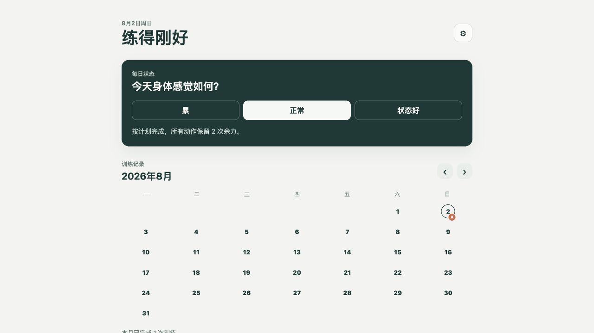
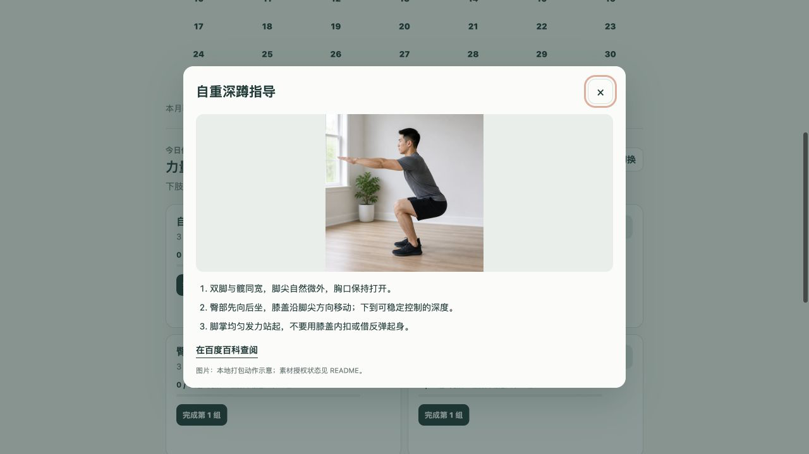
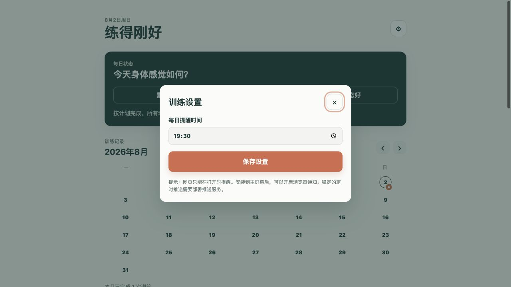

# 练得刚好（Train Well）

一个离线优先的自重与跑走训练计划、动作指导和训练记录工具。网页 PWA、iPhone SwiftUI App 与 Mac SwiftUI App 在同一仓库发布；首个公开版本不含 AI、账户、登录或云端同步。

## 仓库结构

- 根目录：网页 PWA。
- `TrainWellNative/`：iPhone SwiftUI App。
- `TrainWellMac/`：Mac SwiftUI App。

## 界面截图

| 训练计划 | 动作指导 | 本地提醒设置 |
| --- | --- | --- |
|  |  |  |

## 功能

- 四类示例训练：力量 A、力量 B、跑走耐力与恢复日。
- 动作完成勾选、每日训练记录与月历视图。
- 本地打包的动作示意和文字要点；没有图片时显示文字指导。
- 可选本机通知提醒。
- 原生 App 可选择本地照片作为背景，照片只保存在设备本机。

## 运行

### 网页 PWA

在项目根目录启动任意静态 HTTP 服务器，例如：

```sh
python3 -m http.server 8000
```

然后在浏览器打开 `http://localhost:8000`。在 iPhone Safari 中选择“添加到主屏幕”即可安装 PWA。Service Worker 首次打开后缓存页面和动作素材，因此后续可离线使用。

公开网页地址：<https://jkqhillman.github.io/selfweight-training-planner/>。在 iPhone Safari 打开该地址，点击“分享”并选择“添加到主屏幕”，即可长期作为本机 App 使用。

### iPhone App

使用 Xcode 打开 `TrainWellNative/TrainWellNative.xcodeproj`，选择 iOS 模拟器或已配置签名的设备后运行。最低系统版本为 iOS 17。

### Mac App

使用 Xcode 打开 `TrainWellMac/TrainWellMac.xcodeproj`，选择 “My Mac” 后运行。最低系统版本为 macOS 14。

## 数据与隐私

默认不需要账户，也不会向网络服务上传训练内容或个人数据。

- 网页版将训练记录、动作完成状态和提醒时间保存在当前浏览器的 `localStorage`。
- 原生 App 将训练记录与设置保存在设备本机；若选择背景照片，该照片仅保存在本机应用支持目录。
- 删除浏览器站点数据或卸载 App 可能删除这些本地数据，发布版目前不提供导出或同步功能。

完整说明见 [PRIVACY.md](PRIVACY.md)。

## 训练内容与免责声明

训练计划、动作剂量和提示均为可编辑的通用示例，不是医疗、康复、诊断或个性化运动处方。开始前请按自身健康状况调整；如有持续疼痛、近期受伤或其他疑虑，请停止训练并咨询合格的医疗或运动专业人士。

## 素材

动作示意图片由项目作者使用 AI 图像生成工具制作，并随代码本地打包，仅用于界面展示。项目代码采用 MIT 许可证，见 [LICENSE](LICENSE)；图片的使用与再分发仍应遵守所用 AI 工具的服务条款，且不构成医疗或康复建议。

## 发布状态

`v0.1.0` 计划作为“离线训练计划与记录的首个公开版本”发布。网页端真实截图已随仓库提供；GIF 不在首版范围内。原生端真机/模拟器交互验收仍待完成。
